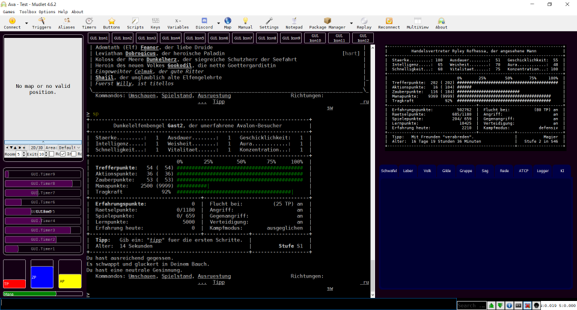

# Avalet

> **Die neue Version von Avalet lässt sich nicht problemlos über die alte Version installieren. Ich empfehle, mit einem neuen, sauberen Profil zu beginnen. Alternativ wäre das alte Modul 'Avalet' zu deinstallieren, dann Mudlet neu starten, dann die neue Version von Avalet installieren.**

> **Für diese Version habe ich Avalet gründlich refaktorisiert, neue Funktionen eingearbeitet und letztlich praktisch jede Zeile Code angefasst. Dabei wird sicher auch ein bisschen was schief gegangen sein. Wer keine Lust auf Betatester hat, bleibt deshalb am besten noch ein paar Tage bei der alten Version.**

Avalet ist ein Module für den Mud-Client [Mudlet](https://www.mudlet.org/) und das MUD [Avalon](https://avalon.mud.de/). Für ein bisschen mehr Farbe, ein bisschen mehr Übersicht und ein bisschen mehr Klicki-Bunti.



<!--img src="latest_screenshot.png" width="30%"></img> </img> </img> </img> </img> </img-->

Funktionen von Avalet:
- Laufen mit dem Ziffernblock! ([Tastaturbelegung](https://github.com/MarcoSteffens/Avalet/wiki/Tastaturbelegung-f%C3%BCr-den-Ziffernblock))
  - Automatisches klettern und schwimmen!
  - Und "spaehen" mit dem Fernrohr durch gleichzeitiges drücken von 'STRG' und der entsprechenden Richtungstaste! (Fernrohr muss natürlich im Invenar sein.)
- Eine nicht zu übersehende Anzeige von TP, AP, ZP und Mana!
- Eine ebenfalls nicht zu übersehende Anzeige von Hunger, Durst und Alkohol
- Eine Anzeige von Kämpfen und von Vergiftungen und anderen unerfreulichen Zuständen.
- Eine Anzeige von Schildzaubern, Auren und anderen Timern! Mit *fancy* *Rückschritts*balken! ;)
- Eine übersichtliche Anzeige der wesentlichen Kommunikationskanäle!
- Eine dauerhafte Anzeige einiger wichtiger (und einiger nicht so wichtiger) Charakter-Informationen!
- Anzeigen bzw. Zähler für EP, Session-EP, Bonusstunden-EP, Schild-EP und Kampfdauer!
- Eine temporäre Anzeige von Informationen wie dem Spielstand, dem Inventar und den Gruppeninformationen!
- Eine schicke Darstellung von "ruebersicht" der Runenschmiede!
- Eine Ausleitung der Ingame-Karte!
- Viel mehr *bling-bling* als Plain-Avalon!

```
            __________________________________________________________
           /                                                        / \
           |                                                        | |
           \________________________________________________________\_/
            |                                                       |
            |  "Wenn so heisser Scheiss jetzt schon verschenkt      |
            |   wird, kann ich den Laden ja bald zumachen!"         |_
            |                               Zwoniman ueber Avalet   | |
            \_______________________________________________________\_/

```

## Was Avalet ist

Avalet ist für Mudlet-Benutzer gedacht, die sich nicht selbst in die Programmierung so einer Oberfläche einarbeiten, aber trotzdem ein bisschen mehr Komfort wollen.

## Was Avalet NICHT ist

Avalet ist kein Ersatz für [das Soundpack](http://www.avalon-soundpack.de) oder für die Arbeit von Ban. Wenn du eine Sprachausgabe benutzt, dann ist dir mit diesen beiden Werkzeugen (und mit MUSHclient) derzeit sicher besser geholfen.

Avalet ist auch nicht gedacht, um mühsam erworbenes "Geheim"-Wissen unter das Avalon-Volk zu bringen. Oder um meine Script-Sammlung zu teilen. Irgendwelche Geheimnisse werden hier nicht aufgedeckt.

```
            __________________________________________________________
           /                                                        / \
           |                                                        | |
           \________________________________________________________\_/
            |                                                       |
            |     "Suuuuperschnelle Lieferung! Dafuer gibt es       |
            |      ein extra <3 von mir!"                           |_
            |                               Lorielle ueber Avalet   | |
            \_______________________________________________________\_/

```

## Installation

Das eigentliche Modul besteht aus der Datei `Avalet.mpackage`. Die speicherst du bei dir irgendwo ab.

Dann legst du dir am besten ein sauberes (also neues) Profil in Mudlet an. Und *entfernst* als erstes in den `Preferences` auf dem Reiter `General` und in der Rubrik `Game protocols` den Haken bei `Enable GMCP`. Ava*lon* sendet per ATCP statt per GMCP, und mit eingeschaltetem GMCP funktioniert Ava*let* nicht.

Anschließend importierst du dann mit dem **Modul-Manager** das vorhin gespeicherte Modul (`Avalet.mpackage`) in dein Profil. Avalet funktioniert nur, wenn es als Modul installiert wird. Nicht als Paket!

Danach sollte alles funktionieren.

(Die Datei Avalet.zip ist - abgesehen vom Namen - identisch mit der .mpackage-Datei, die kannst du also auch nehmen. Aber .mpackage ist der Standard.)

## Update

Für eine **Aktualisierung** einfach die neuere Version der Datei `Avalet.mpackage` (oder `Avalet.zip`) downloaden und die alte damit überschreiben. **Anschließend Mudlet neu starten.**

### Bekannte Fehlerquellen bei der Installation

- Avalet MUSS als MODUL mit dem MODUL-Manager installiert sein. NICHT als Paket mit dem Paket-Manager.
- Im Modul-Manager auf KEINEN Fall das Häkchen bei "Synchronisieren" setzen! Praktisch alles kann dann passieren.
- Nach der Installation AUSLOGGEN mit "schlafe ein" oder "einschlafen", außerdem Mudlet einmal richtig SCHLIESSEN und NEU STARTEN.
- Das Häkchen bei "Enable GMCP" ENTFERNEN. ("Settings", Tab "General", Abschnitt "Game protocols")
- Bei einem Update bleiben manchmal Reste der alten Installation erhalten. In dem Fall entweder von Hand löschen oder mit einem neuen Profil starten.

Alles gemacht? Alles nochmal überprüft? Trotzdem ein Problem? Sprich mich an! Am besten in Avalon, aber per Mail geht auch.

```
            __________________________________________________________
           /                                                        / \
           |                                                        | |
           \________________________________________________________\_/
            |                                                       |
            |   "Wie konnte ich nur jemals ohne Timer spielen?!"    |_
            |                               Rofhessa ueber Avalet   | |
            \_______________________________________________________\_/

```

## Zum selber machen: MyAvalon, das DIY-Modul für Dich

Du hast schon entdeckt, dass viele Aufgaben in Avalon sich durch Trigger sehr erleichtern lassen? Du hast schon ein paar Alias definiert und vielleicht sogar die ersten kleinen Skripte geschrieben? Du möchtest all dies auch bei deinen Zweities verwenden, und nicht jedesmal neu anlegen müssen?

Dann gibt es hier das **MyAvalon**-Modul für Dich! Dieses Modul kannst Du benutzen, um darin eigene Trigger, Timer etc. zu speichern und sie in verschiedenen Profilen, also mit verschiedenen Charakteren zu benutzen. Das Modul ist praktisch leer, aber wenn Du Dich nicht selber damit beschäftigen möchtest, dann nimmt es Dir die Arbeit ab, selber so ein Modul zu erstellen. Wie Du das **MyAvalon**-Modul verwenden kannst, habe ich [hier im Wiki](https://github.com/MarcoSteffens/Avalet/wiki/Das-MyAvalon-Modul) etwas ausführlicher beschrieben.

## Mitmachen?

Ich freue mich über jede Form von Rückmeldung per "rede" oder Mudmail (Rofhessa), Mail (rofhessa@gmx-topmail.de), Brieftaube oder Flaschenpost. Wenn du Lob loswerden willst, (konstruktive) Kritik, Hinweise, Ideen, Bugmeldungen, Featurewünsche oder wenn du einfach nur mal "Hallo" sagen willst, bin ich dein Mensch. Du kannst auch hier auf der Seite einen "*Issue*" eintragen, wenn du magst.

Wenn du Lust hast, dich direkt an diesem Projekt zu beteiligen, freue ich mich natürlich auch. Möglich ist das in Form von einem *pull request*. Solltest du aber einen größeren Beitrag planen, können wir auch andere Möglichkeiten besprechen.

**Beachte bitte, dass Avalet unter einer sehr freien Lizenz steht. Das würde Deinen Beitrag dann einschließen.**

Avalet ist als "Avalon-GUI für jedermensch" gedacht. Die Funktionalität soll entsprechend sein. Also: sinnvolle Unterstützung auch (und grade) für Anfänger. Aber keine Automation für Fortgeschrittene bitte.

```
            __________________________________________________________
           /                                                        / \
           |                                                        | |
           \________________________________________________________\_/
            |                                                       |
            |   "Ich habe Dich bereits erwartet."                   |_
            |          Ein Balrog zum neuesten Release von Avalet   | |
            \_______________________________________________________\_/

```

## Shownotes

Im Laufe der Zeit haben mittlerweile einige Personen einen Betrag zu Avalet geleistet. Einfach durch Feedback, aber auch durch konkrete Zuarbeit, Code und anderes. Ich bin euch allen dafür dankbar. Vor allem das positive Feedback hat dazu geführt, dass ich Avalet so weit entwickelt habe, wie es das derzeit ist.

Und es gäbe Avalet nicht ohne Twrx! Und wenn ich hier immer nur "ich" schreibe, dann liegt das daran, dass er so schlau ist, mich die ganze Tipperei erledigen zu lassen. Aber er hat alle meine doofen Fragen beantwortet, Code-Beispiele geliefert und mich überhaupt erst dazu gebracht, dass ich mich mit Mudlet beschäftigt habe. Also: wenn du Avalet doof findest - beschwer dich bei Twrx. ;)
