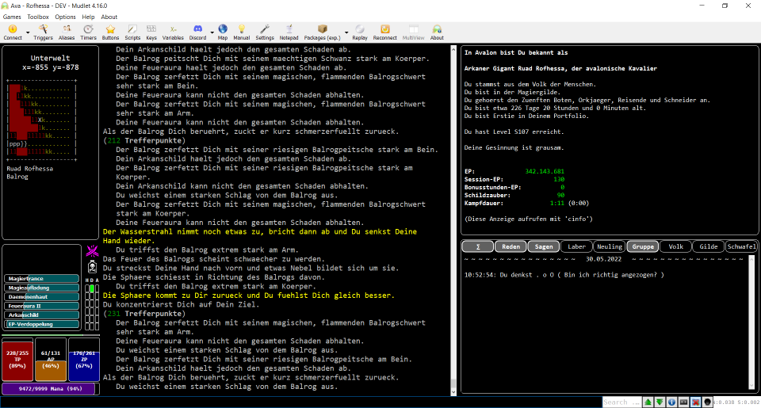

# Avalet

> **Die _nächste_ Version von Avalet wird zwingend [Mudlet in der Version 4.8.2](https://www.mudlet.org/download/) voraussetzen. Weil brandneue Technik zum Einsatz kommt! Updaten also bitte nicht vergessen.**

> **Avalet wird grade sehr aktiv von mir entwickelt und ändert sich deshalb ständig. Das es noch kein automatisches Update (oder sowas) gibt, lohnt es sich, hier häufiger nach einer neuen Version zu schauen. Wenn du einen Fehler findest oder einen Feature-Wunsch hast - schreib mir. Ich bin Rofhessa in Avalon.**

Avalet ist ein Module für das [MUD Avalon](https://avalon.mud.de/) und den Mud-Client [Mudlet](https://www.mudlet.org/). Für ein bisschen mehr Farbe, ein bisschen mehr Übersicht und ein bisschen mehr Klicki-Bunti.

 

Avalet bietet in erster Linie:
- Laufen mit dem Ziffernblock! ([Tastaturbelegung](https://github.com/MarcoSteffens/Avalet/wiki/Tastaturbelegung-f%C3%BCr-den-Ziffernblock))
- Einen nicht zu übersehende Anzeige von TP, AP, ZP und Mana!
- Eine übersichtliche Anzeige der wesentlichen Kommunikationskanäle!
- Eine Anzeige von Schildzaubern, Auren und anderen Timern! Mit *fancy* *Rückschritts*balken! ;)
- Eine dauerhafte Anzeige einiger wichtiger (und einiger nicht so wichtiger) Charakter-Informationen!
- Eine Karte (und einen Mapper)! *(coming soon)*
- Viel mehr *bling-bling* als Plain-Avalon!
- Noch vieles mehr! *(coming soon)*
- Und noch mehr! *(coming soon)*
- Enthält Script von Twrx!!!!!

**Avalet muss unbedingt als Modul installiert werden, nicht als Paket! Und der Charakter muss dazu ausgeloggt sein, nicht nur Statue/disconnected. Auch bei einem Update.** Eine ausführlichere Installationsanleitung findest du weiter unten auf dieser Seite.

### Zum selber machen: MyAvalon, das DIY-Modul

Außerdem gibt es hier das **MyAvalon**-Modul. Dieses Modul kannst Du benutzen, um eigene Trigger, Timer etc. in Mudlet zu bauen, und sie in verschiedenen Profilen, also mit verschiedenen Charakteren zu benutzen. Das Modul ist praktisch leer, aber wenn Du Dich nicht selber damit beschäftigen möchtest, dann nimmt es Dir die Arbeit ab, selber ein Modul zu erstellen. Wie Du das **MyAvalon**-Modul verwenden kannst, habe ich [hier im Wiki](https://github.com/MarcoSteffens/Avalet/wiki/Das-MyAvalon-Modul) etwas ausführlicher beschrieben.

```
            __________________________________________________________
           /                                                        / \
           |                                                        | |
           \________________________________________________________\_/
            |                                                       |
            |  "Wenn so heisser Scheiss jetzt schon verschenkt      |
            |   wird, kann ich den Laden ja bald zumachen!"         |_
            |                               Zwoniman ueber Avalet   | |
            \_______________________________________________________\_/

```

## Was Avalet ist

Avalet ist für Mudlet-Benutzer gedacht, die sich nicht selbst in die Programmierung so einer Oberfläche einarbeiten, aber trotzdem ein bisschen mehr Komfort wollen.

Geplant ist außerdem, dass sich "Submodule" in die Oberfläche von Avalet mit einklinken können, so dass man eigene, individuelle Erweiterungen entwickeln kann. So dass Avalet mit den Bedürfnissen der Benutzer mitwächst. Aber das ist derzeit noch nicht fertig.

## Was Avalet NICHT ist

Avalet ist kein Ersatz für [das Soundpack](http://www.avalon-soundpack.de) oder für die Arbeit von Ban. Wenn du eine Sprachausgabe benutzt, dann ist dir mit diesen beiden Werkzeugen (und mit MUSHclient) derzeit sicher besser geholfen.

Avalet ist auch nicht gedacht, um mühsam erworbenes "Geheim"-Wissen unter das Avalon-Volk zu bringen oder um meine Script-Sammlung zu teilen. Irgendwelche Geheimnisse werden hier nicht aufgedeckt. (Aber es gibt ja die Möglichkeit, Sub-Module hinzuzufügen. Wenn du also *deine* Script-Sammlung gern mit *mir* teilen möchtest - *email me*! :) )

## Bekannte größere Einschränkungen von Avalet derzeit:

- Die Oberfläche skaliert nicht richtig, wenn man die Fenstergröße ändert. Umfangreicheres Problem - bis auf weiteres ist Avalet leider eine Vollbild-Anwendung.

```
            __________________________________________________________
           /                                                        / \
           |                                                        | |
           \________________________________________________________\_/
            |                                                       |
            |  "Mit Avalet haette ich es in 30 Tagen geschafft!"    |_
            |                           Phileas Fogg ueber Avalet   | |
            \_______________________________________________________\_/

```

## Installation

Das eigentliche Modul besteht aus der Datei Avalet.mpackage. Die speicherst du bei dir irgendwo ab.

Dann legst du dir am besten ein sauberes (also neues) Profil in Mudlet an. Und *entfernst* als erstes in den `Preferences` auf dem Reiter `General` und in der Rubrik `Game protocols` den Haken bei `Enable GMCP`. Ava*lon* sendet per ATCP stattdessen, und mit eingeschaltetem GMCP funktioniert Ava*let* nicht.

Anschließend importierst du dann mit dem **Modul-Manager** das vorhin gespeicherte Modul (`Avalet.mpackage`) in dein Profil. Avalet funktioniert nur als Modul, nicht als Paket!

Danach sollte alles funktionieren.

Für eine **Aktualisierung** einfach die neuere Version downloaden und die alte damit überschreiben. **Anschließend Mudlet neu starten.** (Nicht einfach nur *reconnect*en.)

(Die Datei Avalet.zip ist - abgesehen vom Namen - identisch mit der .mpackage-Datei, die kannst du also auch nehmen. Aber .mpackage ist der Standard.)

### Bekannte Fehlerquellen bei der Installation

- Avalet MUSS als MODUL mit dem MODUL-Manager installiert sein. NICHT als Paket mit dem Paket-Manager.
- Im Modul-Manager auf KEINEN Fall das Häkchen bei "Synchronisieren" setzen! Praktisch alles kann dann passieren.
- Nach der Installation AUSLOGGEN mit "schlafe ein" oder "einschlafen", außerdem Mudlet einmal richtig SCHLIESSEN und NEU STARTEN.
- Das Häkchen bei "Enable GMCP" ENTFERNEN. ("Settings", Tab "General", Abschnitt "Game protocols")

Alles gemacht? Alles nochmal überprüft? Trotzdem ein Problem? Sprich mich an! Am besten in Avalon, aber per Mail geht auch.

```
            __________________________________________________________
           /                                                        / \
           |                                                        | |
           \________________________________________________________\_/
            |                                                       |
            |     "Suuuuperschnelle Lieferung! Dafuer gibt es       |
            |      ein extra <3 von mir!"                           |_
            |                               Lorielle ueber Avalet   | |
            \_______________________________________________________\_/

```
## Mitmachen?

Ich freue mich über jede Form von Rückmeldung per "rede" oder Mudmail (Rofhessa), Mail (rofhessa@gmx-topmail.de), Discord (Rofhessa#1552), Brieftaube oder wie auch immer. Wenn du Lob loswerden willst, (konstruktive) Kritik, Hinweise, Ideen, Bugmeldungen, Featurewünsche oder wenn du einfach nur mal "Hallo" sagen willst, bin ich dein Mensch. Du kannst auch hier auf der Seite einen "*Issue*" eintragen, wenn du magst.

Wenn du Lust hast, dich direkt an diesem Projekt zu beteiligen, freue ich mich natürlich auch. Am besten meldest du dich dann und wir besprechen, wie das gehen kann.

**Besonders freuen würde ich mich über Unterstützung beim Design.** Das ist etwas, was ich praktisch überhaupt nicht kann. Wenn du dich da einbringen willst, sprich mich bitte an und lass uns einen Weg finden.

**Beachte bitte, dass Avalet unter einer sehr freien Lizenz steht. Das würde Deinen Beitrag dann einschließen.**

Avalet ist im Moment als "Avalon-GUI für jedermensch" gedacht. Die Funktionalität soll entsprechend sein. Also: sinnvolle Unterstützung auch (und grade) für Anfänger. Aber keine Automation für Fortgeschrittene bitte. Was du in eigenen Erweiterungen von Avalet machst, musst du selber wissen.

```
            __________________________________________________________
           /                                                        / \
           |                                                        | |
           \________________________________________________________\_/
            |                                                       |
            |   "Wie konnte ich nur jemals ohne Timer spielen?!"    |_
            |                               Rofhessa ueber Avalet   | |
            \_______________________________________________________\_/

```

## Shownotes

Es gäbe Avalet nicht ohne Twrx! Und wenn ich hier immer nur "ich" schreibe, dann liegt das daran, dass er so schlau ist, mich die ganze Tipperei erledigen zu lassen. Aber er hat alle meine doofen Fragen beantwortet, Code-Beispiele geliefert und mich überhaupt erst dazu gebracht, dass ich mich mit Mudlet beschäftigt habe. Also: wenn du Avalet doof findest - beschwer dich bei Twrx. ;)

```
            __________________________________________________________
           /                                                        / \
           |                                                        | |
           \________________________________________________________\_/
            |                                                       |
            |   "Ich bin Groot!"                                    |_
            |                                  Groot ueber Avalet   | |
            \_______________________________________________________\_/

```